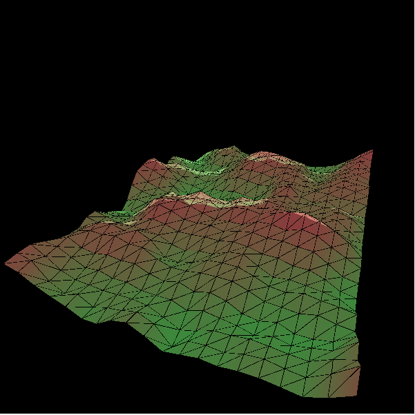

# Perlin Noise Terrain
Simple implementation based on the code train on 

Also possible to run on editor.p5js.org by pasting sketch.js into the editor and hit run.

# Purpose
To illustrate a better way to visualize a song and using wave forms.

# Result

